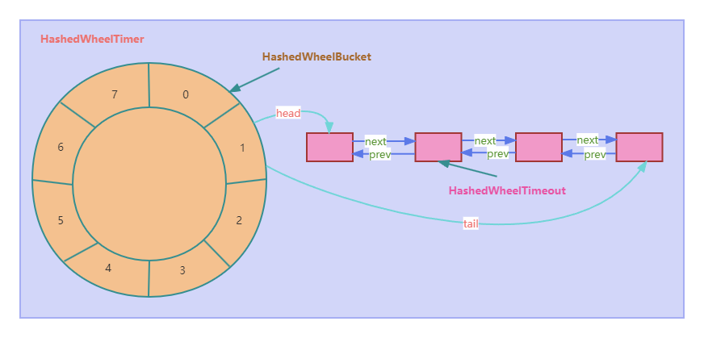

# 订单超时处理

## 前言
订单超时自动取消是电商平台中常见的功能之一，例如在淘宝、京东、拼多多等商城下单后，如果在一定的时间内没有付款，那么订单会自动被取消，是怎么做到的呢？作为技术人员我们应该了解自动取消的原理和实现逻辑，本文将介绍几种常用的技术方案，帮助开发者实现订单超时自动取消的功能。

## 方案一：JDK延迟队列DelayQueue

### 方案描述
JDK中的DelayQueue可以实现延迟，是一个无界阻塞队列，其实底层使用的是优先级队列PriorityQueue，可以对放入的对象进行排序，对象需要实现Delayed接口，采用阻塞的方式获取数据，也就是相当于延迟时间到了就会获取到数据。

### 优点
不需要任何第三方依赖，实现非常简单

### 缺点
数据全部保存在JVM内存中，占用内存，可能会引发内存溢出，另外宕机或重启数据会全部丢失，无法做集群。

## 方案二：时间轮算法(netty的HashedWheelTimer)

### 方案描述
时间轮算法用的是一个环形的数据结构（使用数组实现），每一轮相当于沿着环形走一圈，类似于钟表，可以分成很多格子（秒针一圈分成60格，算法中叫bucket，这个bucket里可以存放任务），然后每个格子有持续的时间间隔（比如秒针一个格子是1秒，也就是走过这一格持续1秒的时间，算法中对应的是tickDuration）。时间轮算法有多种实现，单轮算法，多轮算法（相当于在单轮上做了循环），分层时间轮算法（类似于水表，有多个表盘共同计算出总水量） 时间轮算法使用一个worker线程，将任务放到计算获得的bucket里，并按指定的时间间隔tickDuration去执行bucket的时间到期任务。netty4版本中的时间轮结构如下：

图片图中HashedWheelTimer内部存储使用的是HashedWheelBucket数组，形成一个环形结构，每一个HashedWheelBucket中存储的是HashedWheelTimeout双向链表，在HashedWheelTimeout中存的是TimerTask，就是具体要执行的任务。假设当前指针指在3上，如有有一个任务2秒后执行，那么会存在5的格子上，如果有一个任务8秒后执行，则会放到3上，转了一圈，这时任务的轮数就加了1。

### 优点
精度灵活可控制，执行效率高，延迟时间比DelayQueue队列低。

### 缺点
同DelayQueue一样，数据全部保存在JVM内存中，占用内存，可能会引发内存溢出，另外宕机或重启数据会全部丢失，大数据量的情况下也会影响延迟精度。

## 方案三：定时轮询(quartz实现)

### 方案描述
通过定时任务的方式去轮询扫描数据库表，根据订单有效期来判断订单是否到期，到期则更新订单状态。这里我们使用quartz作业调度框架来实现定时轮询。

### 优点
这种方案优点是实现简单，通过quartz框架进行任务调度，无其他依赖，支持集群部署。

### 缺点
简单粗暴的全表扫描方式对数据库性能影响特别大，可能影响其他正常的业务操作响应时效，另外配置扫描时间间隔也是个问题，配置大了，扫描延迟，影响取消订单的精准时间，在数据量较大的情况下，配置小了影响数据库性能，所以需要根据实际情况进行评估。

## 方案四：RocketMQ消息队列

### 方案描述

通过RocketMQ的延迟消息，根据订单超时时间设置对应的延时时间。

### 优点
RocketMQ消息服务可靠性高，消息处理速度快，支持大数据量，并且支持分布式横向扩展方便。

### 缺点
引入RocketMQ中间件系统复杂度增高，运维成本增加，使用起来配置较复杂，且还需要自行处理消息幂等性。

## 总结
订单超时自动取消是电商平台中非常重要的功能之一，通过合适的技术方案，可以实现自动化处理订单超时的逻辑，提升用户体验和系统效率。本文介绍了几种常用的技术方案，开发者可以根据具体的业务需求和技术栈选择合适的方案，并结合相应的文档和示例进行实现和配置。